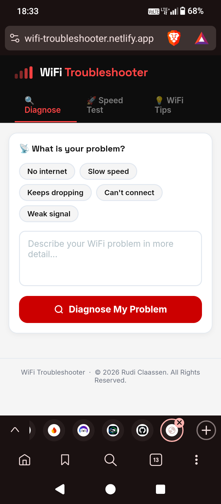
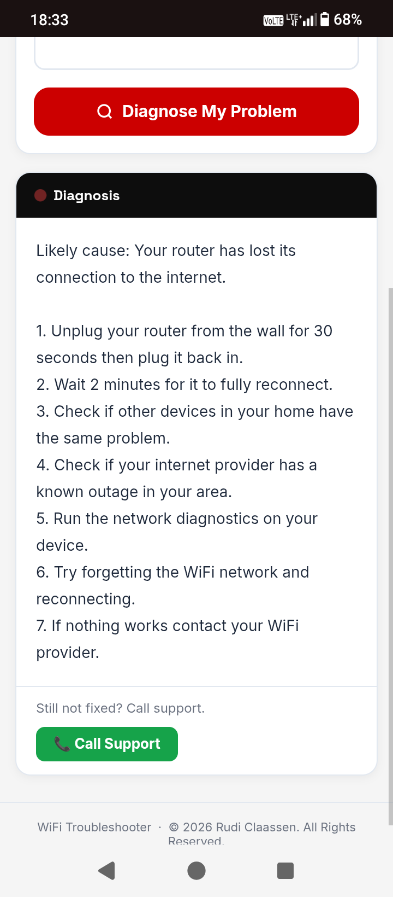
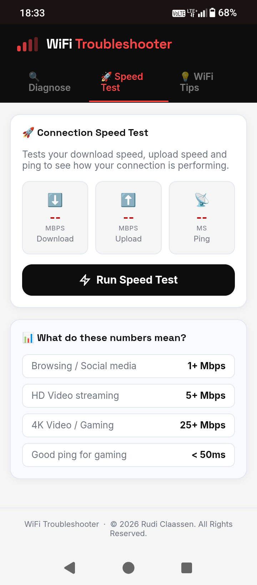
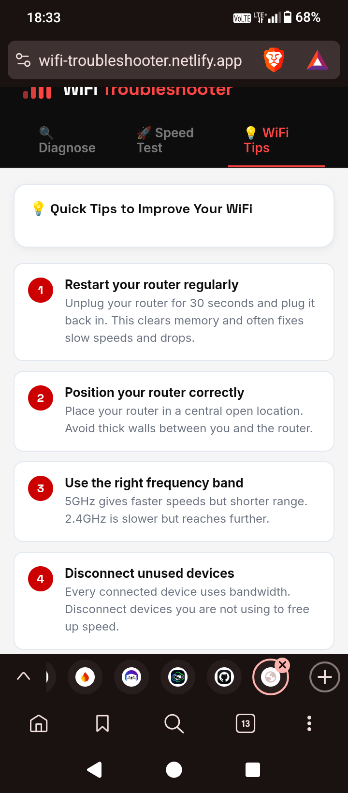

# WiFi Troubleshooter

A white-label WiFi troubleshooting tool for ISPs. Guides customers through step-by-step diagnostics so they can fix common connection problems themselves, cutting support calls.

**Live demo:** https://wifi-troubleshooter.netlify.app/

## Features
- Step-by-step guided diagnostics for common WiFi and connection issues
- Custom branding per ISP (logo, colours, name)
- Installable as a PWA, also available as an Android app
- Super admin panel for managing ISP clients
- Hosted and managed for each client

## Built with
- Vanilla JavaScript, HTML, CSS
- Firebase (Firestore + Auth)
- Netlify

## About
Built solo by Rudi Claassen as part of SiteLink Solutions. The Firebase config is not included in this repo, so please use the live demo above.
